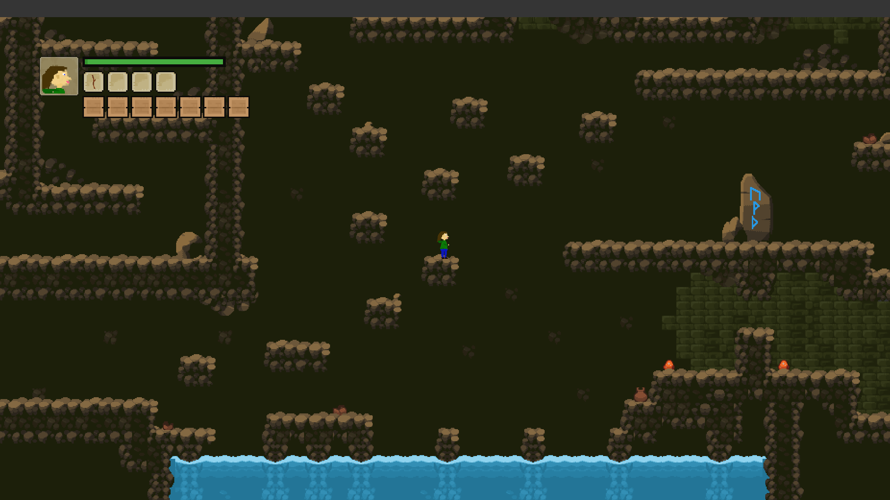

Super Agile Bros

"Super Agile Bros" is a 2D platformer game where the player will traverse through various levels, battling enemies, avoiding traps, and solving logical puzzles. The game will feature a character-switching system during gameplay, adding diversity and encouraging players to explore their abilities and applications. A local multiplayer mode will allow players to enjoy the game with friends and may even unveil functionalities that were not possible when playing alone. "Super Agile Bros" includes a storyline that will enhance the journey, giving it a purpose, and often bringing a smile to the player's face.

Language: GDScript

Renderer: GLES 2

## Screenshots

